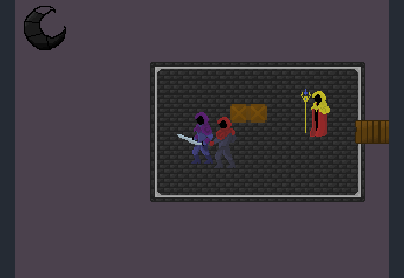
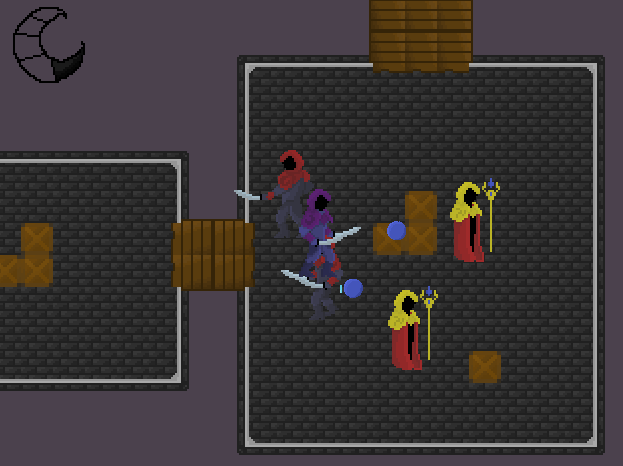
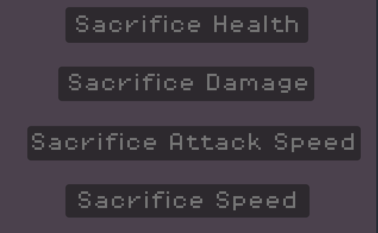
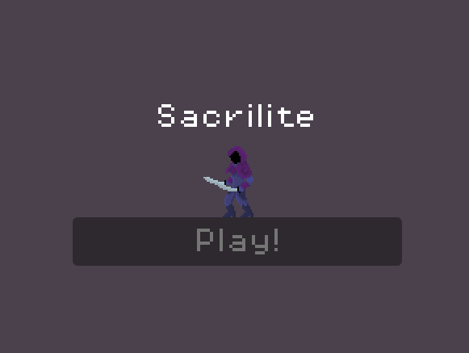
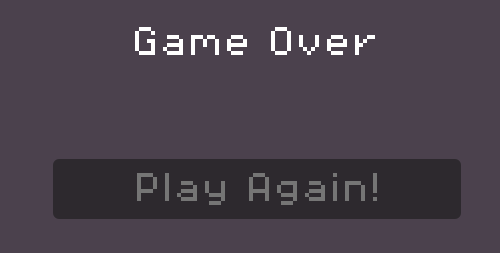

# Overview

Sacralite is a sacrificial roguelike game made using the godot game engine. The aim is to kill all of the enemies and make it to the portal. Completing all of the levels allows you to win the game.

We built the game as a team at Daydream Cambridge, a global gamejam hosted in hundreds of cities throughout the world.

To play the game yourself, find it on itch here: https://thesupernile.itch.io/sacrilite

# How to play

To move, you can use 'wasd' or the arrow keys to move up, left, down and right respectively.

To attack the enemies, you can use either the space key or 'z'

# Screenshots

Gameplay Screenshots:

Sacrifices Screen:

Main Menu:

Game Over:

